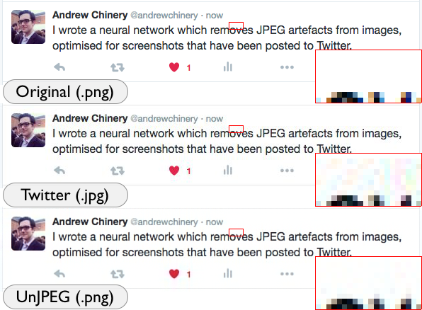

##UnJPEG: removing jpeg artefacts from screenshots with a neural network

Note: this is just a pet project to teach myself about neural networks and Theano, but I've managed to get some interesting results (below) that I might do more with at some point.

Note 2: the image data I used to train the ANN is not on github for size reasons.

Here is an example of the current results. I wrote a tweet about the project, took a screenshot (the first image), uploaded that screenshot to Twitter, downloaded that image (middle image), and ran it through the neural network (final image).

Log:
2016/09/26
* Minor changes. Added (rather, fixed) the ability to initialise the model with existing parameters, so I could make a non-GPU dependent version of the pickled model. Not sure if it was caused by this or not, but suddenly I was getting errors with float64 dtype (even though I always use theano.config.floatX). The cause was scaling the learning rate by the number of input neurons, it needed an explicit cast to work properly. But the code hadn't changed, I have no idea why this didn't come up before.
* Trained a new model that's a bit smaller to improve performance.
* Tweaked a couple of things including rounding when saving the image (not sure if the cast rounds or not), also clipping during the error measure. Not sure what precisely caused it, could even just be the new model size, but I finally got a pure white output on my test image! The results have been updated with this new model.

2016/09/24
* Have been far down the rabbit hole of trying to find the 'right' parameters to normalise the input data; for some reason the theoretical values produce worse results than ones that are higher. I tried decorrelating the data using PCA as well as using the 'correct' values: still no better. Ended up reverting all that work back to the old method. But did some other stuff in the meanwhile...
* As well as implementing a system which loads blocks of data on and off the GPU, the code now saves training data in batches, meaning it can load it in and out of RAM to use the full training set (~9million patches). This breaks the old probabilistic version which still has some lingering code, but I hope brand new examples are always better than repeated ones.
* Loading code can now take a block size (in multiples of 8). It then saves overlapping NxN blocks, and when applying the network it takes the average value returned in overlapping regions (a method adapted from [1]).
* Decided to optimise for a single set of JPEG parameters, specifically those used by Twitter. I used jpegsnoop to confirm the quantisation tables are identical for Pillow's JPEG encoder using quality 85 and 4:1:1 subsampling. At some point I might try the generalist version to see how that works.
* Best results use 24x24 blocks with 4 hidden layers of 8000 neurons each. Raising those numbers might produce even better results.
* One lingering bug: one test image is a screenshot from Twitter (above) which has a white background. For some reason the result NEVER had a pure white background, the best I got was 255 in two channels, and 254 in the other. Seems too specific to not be a bug. But never found the cause. I might add a hack into the UnJPEG code which matches the output to the input as closely as possible: I don't think this is cheating, but it's not pure neural network.

2016/09/13
* Tried a lot of ideas in the past week or so, in no particular order:
    * Shuffle the input blocks
    * Creating multiple 'parallel' layers like a CNN, initially choosing one using a 'predictor' layer (like pooling), later trying a fully combined network. Never really improved performance.
    * I finally read the Burger et al. 2012 paper [1] and some of the book 'Neural networks: Tricks of the trade' [2]. Learned lots of tricks. Tried normalising each image but that didn't work at all, so implemented parameters to normalise the whole dataset. Implemented many suggestions from the book: change learning rate per layer in proportion to incoming connections, normalising, using (1.7...)tanh((2/3)x) as the activation function. Used the network parameters from the paper: 2047 neurons in 4 hidden layers. This required moving to GPU acceleration which itself had some headaches (I set up a system for moving data on and off the GPU in batches to reduce overhead). This seemed to get some promising results.
    * One suggestion from the book was to increase the chance of repeating training examples which had higher errors, because these will best train the network. I spent a while implementing some different forms of this, but I could never really tell how successful it was.
* I'm trying my last few ideas on my Windows PC (more headaches) which has the best GPU. I believe I'm almost at something which you could call a result and I'll roll my changes back into the master branch once I've got that working.

2016/09/01	
* Borrowed multi-layer-perceptron (artificial neural network) code from deeplearning.net  
http://deeplearning.net/tutorial/mlp.html  
* Tweaked to change output from a single integer (classification) to the same size as the input (8x8x3 blocks, the same size jpeg uses)

[1] http://www.hcburger.com/files/neuraldenoising.pdf

[2] http://yann.lecun.com/exdb/publis/pdf/lecun-98b.pdf
